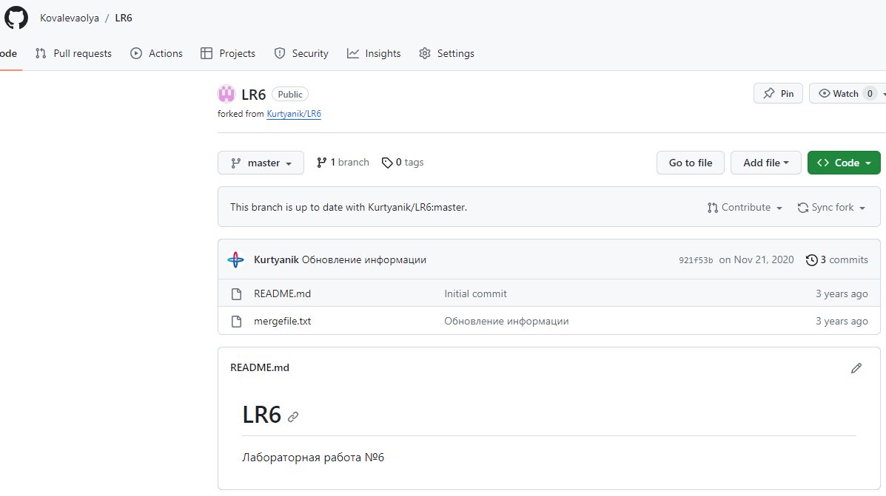
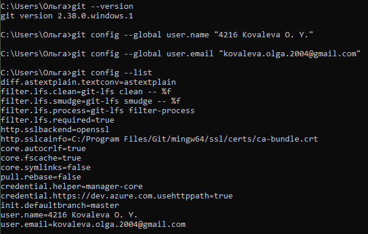
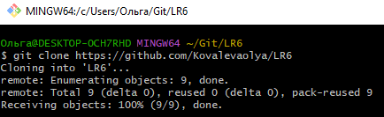
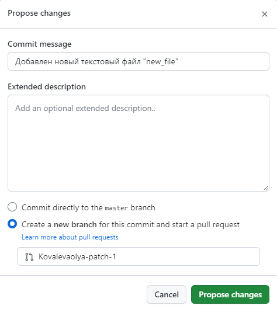
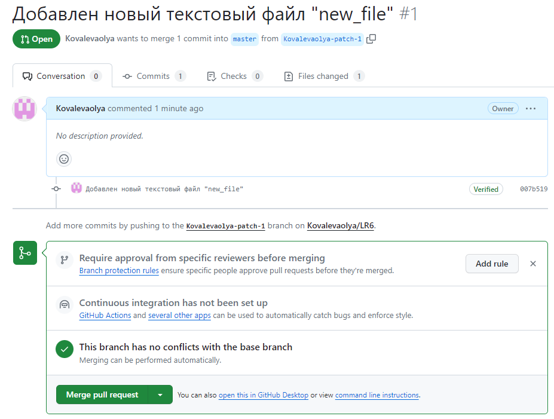
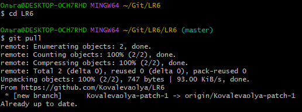
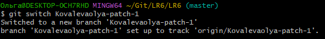

# LR6

## Лабораторная работа №6

### **1-2**

*В аккаунте на сайте GitHub сделана копия в личное хранилище.*
|  |
|:---:|
| *картинка 1-2* |

### **3-4**

*Проверка, установлен ли Git. Настройка клиент git, ввод данных.*
|  |
|:---:|
| *картинка 3-4* |

### **5**

*Клонирование своего личного удалённого репозитория на компьютер.*
|  |
|:---:|
| *картинка 5* |

### **6**

*Добавление файла через интерфейс GitHub. Подтяжка изменений в локальный репозиторий.*
|  |
|:---:|
| *картинка 6.1* |

|  |
|:---:|
| *картинка 6.2* |

|  |
|:---:|
| *картинка 6.3* |

|  |
|:---:|
| *картинка 6.4* |
