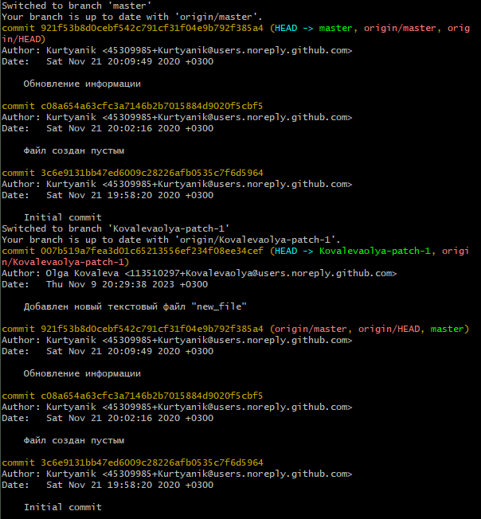
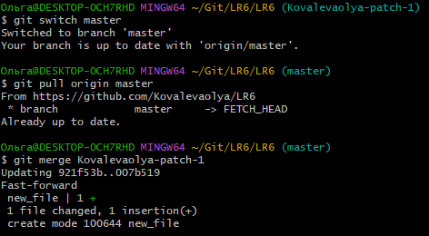
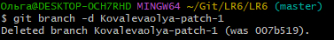
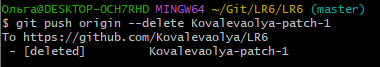
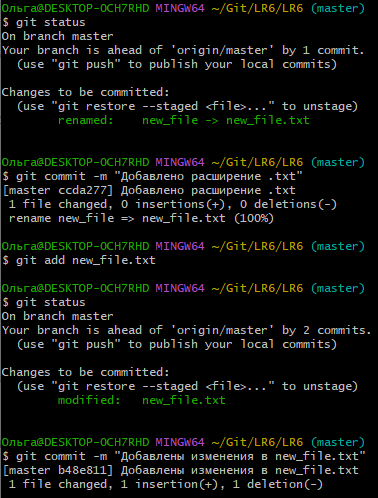
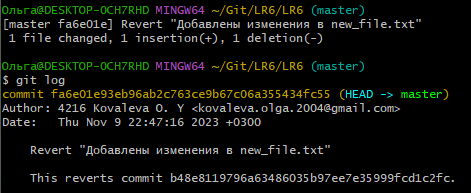
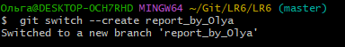

# LR6

## Лабораторная работа №6

### **1-2**

*В аккаунте на сайте GitHub сделана копия в личное хранилище.*
|  |
|:---:|
| *картинка 1-2* |

### **3-4**

*Проверка, установлен ли Git. Настройка клиент git, ввод данных.*
|  |
|:---:|
| *картинка 3-4* |

### **5**

*Клонирование своего личного удалённого репозитория на компьютер.*
|  |
|:---:|
| *картинка 5* |

### **6**

*Добавление файла через интерфейс GitHub. Подтяжка изменений в локальный репозиторий.*
|  |
|:---:|
| *картинка 6.1* |

|  |
|:---:|
| *картинка 6.2* |

|  |
|:---:|
| *картинка 6.3* |

|  |
|:---:|
| *картинка 6.4* |

### **7-8**

*Получение истории операций для каждой из веток, просмотр последних изменений.*
|  |
|:---:|
| *картинка 7-8* |

### **9**

*Выполнение слияния в ветку master.*
|  |
|:---:|
| *картинка 9* |

### **10**

*Удаление побочной ветки после успешного удаления.*
|  |
|:---:|
| *картинка 10.1* |

|  |
|:---:|
| *картинка 10.2* |

### **11**

*Несколько раз внесение изменений, их фиксация с комментариями.*
|  |
|:---:|
| *картинка 11* |

### **12**

*Откат коммита, проверка.*
|  |
|:---:|
| *картинка 12* |

### **13**

*Создание ветки для отчёта.*
|  |
|:---:|
| *картинка 13* |
